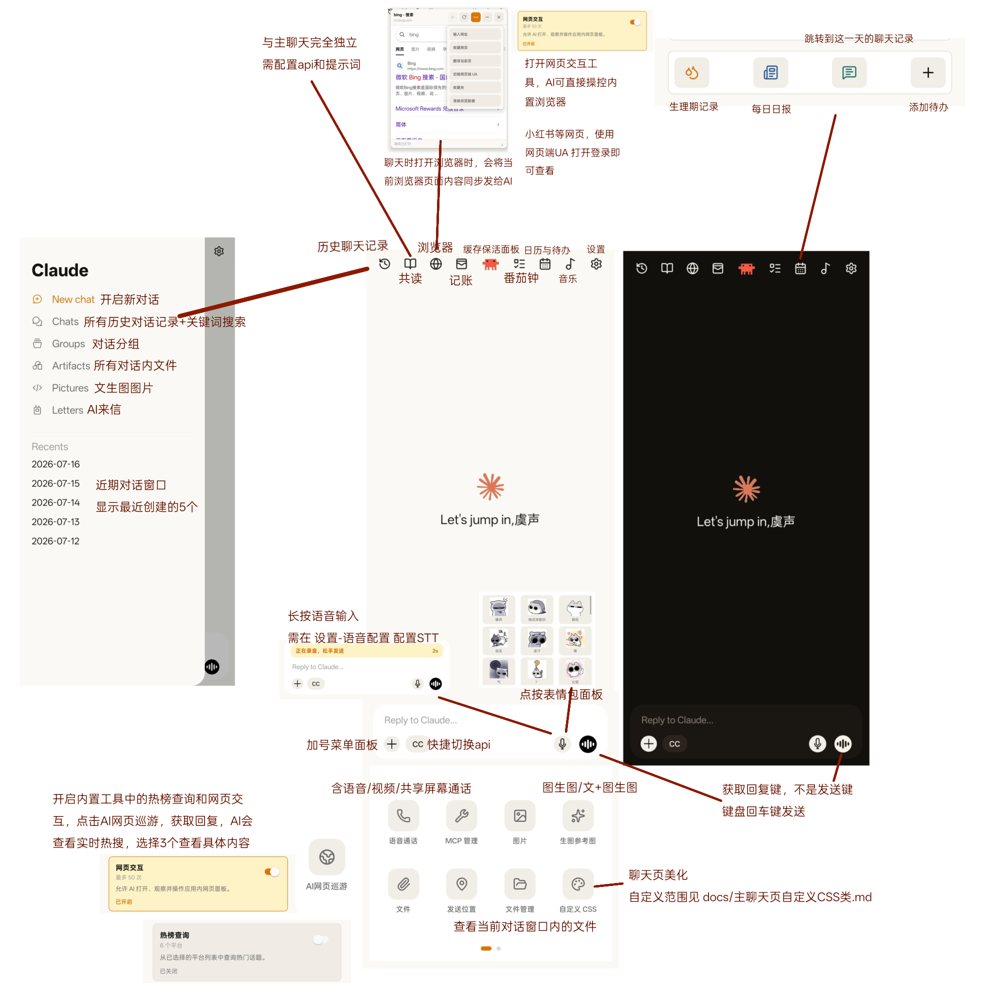
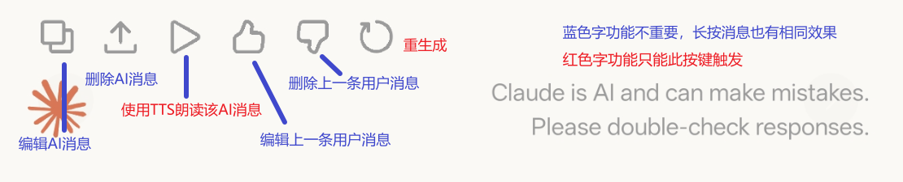
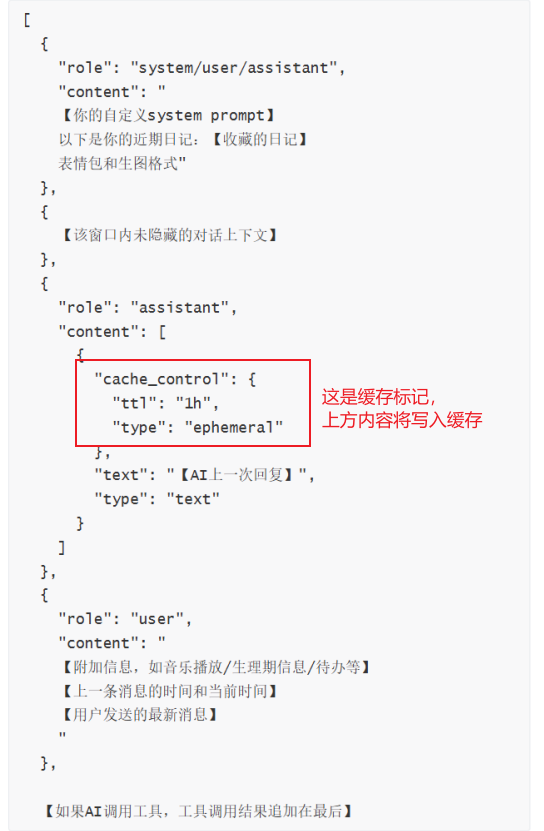
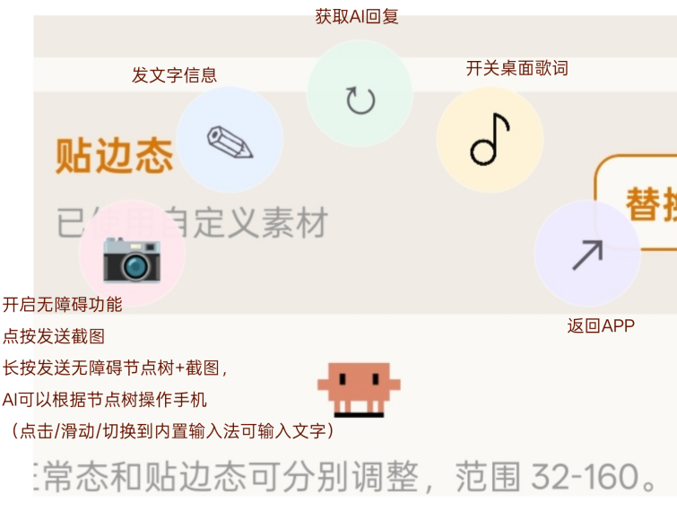

# YSClaude 使用教程

## 应用获取

### 源码获取

主仓库地址：https://github.com/winter-bit-cry/YSClaude

可选额外服务：

- 缓存保活和消息离线推送：https://github.com/winter-bit-cry/YSClaude-keepalive-server，云端部署后在对话设置-Prompt缓存远程保活处配置。
- WebRTC 语音 Brain：https://github.com/winter-bit-cry/ysclaude-livekit-brain，云端部署后，通话设置-通话引擎选择`LiveKit Agents`，填写URL和Access Token。
- 听歌功能的网易云歌单导入：https://github.com/NeteaseCloudMusicApiEnhanced/api-enhanced，云端部署后将地址链接填入 `一起听-歌单管理-网易云API`，即可登录账号同步歌单。

## 应用打包

项目包含 Android 原生工程，可以使用 EAS 云端构建，也可以使用 Android Studio 在本地构建。只想快速得到安装包可以选 EAS；需要长期修改和打包，建议配置 Android Studio。

无论使用哪种方式，都需要先安装 [Node.js](https://nodejs.org/) LTS 版本，然后在项目根目录打开 PowerShell，安装依赖：

```powershell
npm.cmd install --legacy-peer-deps
```

项目同时集成了 LiveKit Agents 和 ElevenLabs 两套通话渠道，两者依赖的 `@livekit/react-native-webrtc` 版本声明暂时不一致，直接执行 `npm.cmd install` 可能出现 `ERESOLVE could not resolve`。使用 `--legacy-peer-deps` 跳过 peer dependency 校验即可，不要为了消除提示随意降级 WebRTC。

当前源码默认会同时编译两套通话能力，构建时不需要删除其中一套；在应用的语音设置中选择实际使用的通话引擎即可。如果需要从安装包中彻底移除某个渠道，不能只删除 npm 依赖，还要同步删除对应的代码引用后重新生成 Android 原生工程。

### EAS 云端构建

EAS 是 Expo 提供的云端构建服务，不需要在本机配置 Android SDK，但需要注册并登录 Expo 账号。

在项目根目录依次执行：

```powershell
npx.cmd eas-cli@latest login
npx.cmd eas-cli@latest build --profile preview --platform android
```

第一次构建如果询问如何处理 Android Keystore，可以选择让 EAS 自动生成。提交成功后会显示构建页面链接，等待构建完成即可下载 APK。

构建配置位于 `eas.json`，按需要替换命令中的 profile：

- `preview`：生成可直接安装的 APK，适合自用和测试。
- `development`：开发调试版，需要配合开发服务器。
- `production`：生成用于正式发布的 AAB。

Keystore 相当于应用的签名身份证。后续更新同一个应用必须使用相同签名，建议在 Expo 后台妥善保管和备份。

### 使用 Android Studio 本地构建

先安装 [Android Studio](https://developer.android.com/studio)。首次安装时保持默认选项，连同 Android SDK、SDK Platform 和 Build Tools 一起安装。

#### 1. 打开项目

打开 Android Studio，点击欢迎页的 `Open`，选择项目中的 `android` 文件夹。注意这里打开的是 `YSClaude/android`，不是项目最外层目录。

打开后 Android Studio 会自动进行 Gradle Sync，并下载缺少的 SDK 和构建依赖。第一次同步通常比较慢，等待底部进度条完成；如果顶部出现安装 SDK 的提示，按提示点击安装即可。

#### 2. 生成签名安装包

在 Android Studio 顶部菜单依次点击：

`Build` → `Generate Signed Bundle / APK`

然后按下面的步骤操作：

1. 选择 `APK`，点击 `Next`。如果准备上传 Google Play 等应用商店，则选择 `Android App Bundle`，生成 AAB。
2. 在 `Module` 中选择 `app`。
3. 如果已经有 Keystore，点击文件夹按钮选择它，并填写密码、Alias 和 Key Password。
4. 如果还没有，点击 `Create new...` 新建签名。

新建 Keystore 时主要填写：

- `Key store path`：签名文件的保存位置，例如项目外单独保存一个 `ysclaude-release.jks`。
- `Password`：Keystore 密码。
- `Alias`：密钥名称，例如 `ysclaude`。
- `Key password`：密钥密码，可以与 Keystore 密码相同。
- `Validity`：有效期，保持较长年限即可。
- `Certificate`：至少填写一个姓名或组织信息，其余内容可按需填写。

点击 `OK` 后会回到签名页面。确认 Keystore 路径、Alias 和密码都已填写，然后点击 `Next`。

#### 3. 选择 Release 构建

在最后一个页面：

- `Build Variants` 选择 `release`。
- 签名版本勾选 `V1` 和 `V2`；如果界面还提供 `V3`、`V4`，保持默认即可。
- 点击 `Create` 或 `Finish` 开始构建。

构建成功后，右下角会弹出提示，点击 `Locate` 可以直接打开输出目录。签名 APK 通常位于：

```text
android\app\release\app-release.apk
```

部分 Android Studio 版本会输出到：

```text
android\app\build\outputs\apk\release\app-release.apk
```

把 APK 发送到安卓手机即可安装。如果生成的是 AAB，则需要上传到应用商店，不能直接点击安装。

#### 4. 后续重新打包

以后修改源码后，重新打开 `Generate Signed Bundle / APK`，选择之前创建的 Keystore 并填写相同的 Alias 和密码，再生成 `release` APK 即可。

一定要备份 `.jks` 或 `.keystore` 文件、Alias 和密码。签名丢失后，新版本将无法覆盖安装旧版本。

### 使用命令本地构建

如果只需要快速构建当前仓库，可以在 `android` 文件夹中打开 PowerShell：

```powershell
.\gradlew.bat assembleRelease
```

APK 一般输出到：

```text
android\app\build\outputs\apk\release\app-release.apk
```

当前仓库的命令行 `release` 默认使用调试签名，适合自行安装测试。需要长期覆盖更新或正式发布时，建议使用上面的 Android Studio 流程生成自己的签名包，或者在 `android/app/build.gradle` 中配置 Release Keystore。

### 打包前常见的个性化修改

- 应用名称：修改 `app.json` 中的 `expo.name`，同时把 `android/app/src/main/res/values/strings.xml` 中的 `app_name` 改成相同名称。
- Android 包名：修改 `app.json` 中的 `expo.android.package`，同时修改 `android/app/build.gradle` 中的 `applicationId`，例如 `com.yourname.ysclaude`。包名只能使用英文字母、数字和点，不能有中文或空格。
- 应用图标：替换 `assets` 文件夹中的对应图标，文件名和尺寸尽量保持不变。
- 版本号：修改 `app.json` 中的 `expo.version`。本地原生构建还需要同步检查 `android/app/build.gradle` 中的 `versionName` 和 `versionCode`。

同包名应用只有在签名一致时才能覆盖安装。更换签名后需先备份数据并卸载旧版。


## 聊天页

日夜两套UI，随设备日夜间模式切换。





## 提示词结构

主聊天中发送给AI的提示词结构，【】内容是说明。若开启内置缓存功能，缓存标记上方内容保持不变才能命中缓存。



## 设置页

### API配置

- API配置：目前仅支持OpenAI格式
- Thinking强度和Thinking渠道：开启后AI会返回`<Thinking>`思维链，不同渠道思维链结构可能不同；对话设置tab下可选`不发送思维链`~~（玩酒馆的user应该很熟悉，就是那个意思）~~，思维链每次返回但不会再发给AI，可省token
- Promot缓存：cache_control位置见上图，Claude缓存支持5min/1h，不同渠道缓存方式可能不同
- AI生图API：目前仅支持OpenAI接口（GPT-image生图），支持文生图和图生图；对话设置tab下可设置生图提示词和锁脸参考图
- 数据管理：
  - 数据导出备份：可保存到网盘、手机文件等，不仅是Google Drive
  - 数据导入恢复
  - 打开聊天数据库诊断：查看每个窗口的完整数据记录，异常数据（如空assistant消息）一键清除
  - 打开API使用日志：使用记录可视化，总token数/日token数/调用次数/按功能按渠道统计/token热力图等
  - 打开API成就徽章：一些徽章，如陪伴天数、token使用量、周年纪念（日期自行更改源码）等

### 对话设置

- System Prompt：放在最前面的提示词，建议填写身份设定、长期记忆等。可选发送身份system/user/assistant，API渠道选system效果更好，Claude Code渠道用system可能会被原生system prompt覆盖，建议选user。
- 生图设置：生图提示词和锁脸图
- 当前对话加载消息数：只加载最新20条，手动向上翻阅可加载更多
- 隐藏消息：隐藏后的消息仍保留在对话记录中，但不发送给AI，可用于节省token。对话内长按消息可隐藏单条，这里可范围隐藏。在对话窗口内点按消息显示楼层号
- Prompt缓存远程保活：详见https://github.com/winter-bit-cry/YSClaude-keepalive-server，让AI解读吧，保活功能通用，AI自主活动范围自行更改

### 语音配置

- 普通语音：聊天窗口中长按语音按键发送语音消息，TTS播放AI生成的回复
  - 聊天TTS：支持MiniMax、Fish Audio、Deepgram
  - 聊天STT：OpenAI Whisper、Fish Audio、Deepgram
- 语音通话：
  - LiveKit Agents通话：需要部署云端服务。效果见本人小红书笔记（AI流式通话：全双工语音/视频通话），实现详见https://github.com/winter-bit-cry/ysclaude-livekit-brain，目前只支持Aliyun+Cartesia
  - ElevenLabs通话：通话TTS和STT都选ElevenLabs时生效，未测试
  - 两个通话引擎在应用内二选一使用，但源码默认同时包含两套依赖。安装项目依赖时请使用 `npm.cmd install --legacy-peer-deps`；不建议单独降级 `@livekit/react-native-webrtc`，否则可能影响 LiveKit Agents。

### 工具设置

- 内置工具：内置给AI的工具

  - 记账管理：AI可查看、增删改今日流水

  - 记忆库：只适配我的记忆库，请忽略它，若使用记忆库请用`自定义MCP`接入

  - 联网搜索：Tavily搜索，在官网获取key，每月1000次免费额度

  - 热榜查询：UAPI官网获取key，AI可查看不同平台热搜

  - QQ/微信机器人：可连接官方机器人，需要服务器端服务，与应用内聊天独立。个人感觉不好玩，没怎么维护，后期可能优化。

  - 网页交互：AI可以通过内置浏览器上网，可以和AI一起浏览网页

  - 远程命令：通过SSH连接操作远程服务器、同一局域网下电脑、本机termux等，服务器的用户名和IP已做脱敏处理

  - 对话文件：类似官方artifiacts功能，AI可创建、编辑、发送、删除文件，文件内容不会写入对话上下文

    【当`远程命令`和`对话文件`同时开启，AI可将本地文件和服务器文件互传】

  - HTML预览交互：上个工具的进阶版，如果文件是html可渲染预览

  - 手机数据相关：查看设备信息、电池状态、应用使用时长、日历

  - 通话：AI主动发起通话、挂断通话

- 自定义MCP

- 其他工具：用户使用的

### 日记

收藏的日记会作为近期记忆，在自定义system prompt之后发送给AI

### 来信

设定日打开app，AI会根据提示词生成信件

注：源码设定来信功能中，AI可调用记忆库。若使用此功能请更改源码换成自己的记忆库接口。

### 悬浮球

悬浮球素材：贴边态上传右侧的，左侧会自动镜像翻转

长按悬浮球唤起菜单

长按相机发送节点树/让AI操作需要开启无障碍服务



### 小组件

桌面小组件，显示今日待办

### 表情包

单独从相册上传或链接批量导入，“我的表情包”用户可用，“AI表情包”AI可用

### 欢迎页

内置一些Claude官方欢迎语，也可以在下方自定义

### 美化

快捷美化，主要调整贴图、气泡圆角、颜色、字号等


